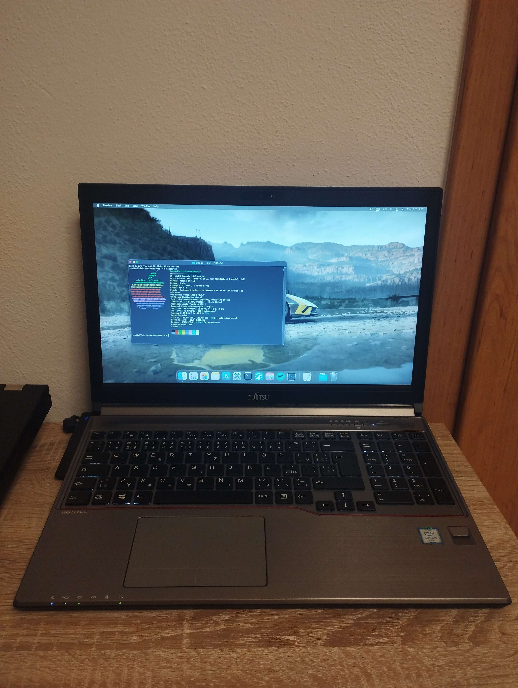
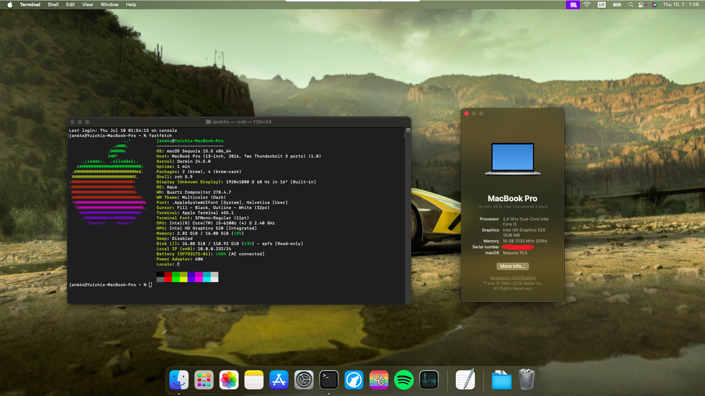

# Hackintosh - Fujitsu Lifebook E756 (macOS Sequoia)

A working OpenCore configuration for running macOS Sequoia on the Fujitsu Lifebook E756.

## Images

## Hardware Specifications

| Component | Details |
|-----------|---------|
| **Model** | Fujitsu Lifebook E756 |
| **CPU** | Intel Core i5-6200U (Skylake) |
| **WiFi** | Intel Dual Band Wireless-AC 8260 |
| **Cellular** | Sierra Wireless EM7305 (untested in macOS) |
| **Display** | 1920x1080 |
| **RAM** | 16GB DDR4 2400MHz (2x8GB) |
| **Storage** | 128GB SATA SSD |
| **BIOS Version** | Rev 5.0 |

## What's Working

- [x] CPU power management
- [x] Intel WiFi (via itlwm)
- [x] Ethernet
- [x] Audio (via AppleALC)
- [x] Bluetooth
- [x] Keyboard & Trackpad
- [x] Battery management
- [x] Brightness controls
- [x] Sleep/Wake
- [x] Graphics acceleration (Intel HD Graphics 520)

## What's Not Working (or untested)

- [ ] Sierra Wireless EM7305 WWAN card
- [ ] Fingerprint reader

## Key Components

### ACPI Patches
- SSDT-ALS0.aml (Ambient Light Sensor) (untested)
- SSDT-MCHC.aml (Memory Controller)
- SSDT-PLUG.aml (CPU Power Management)
- SSDT-PNLF.aml (Backlight)
- SSDT-SBUS.aml (System Management Bus)
- SSDT-USBX.aml (USB Power)
- SSDT-XOSI.aml (OS Identification)

### Essential Kexts
- **Lilu.kext** - Kernel extension library
- **VirtualSMC.kext** - SMC emulation
- **WhateverGreen.kext** - Graphics patching
- **AppleALC.kext** - Audio support
- **IntelMausiEthernet.kext** - Ethernet support
- **itlwm.kext** - Intel WiFi support
- **VoodooPS2Controller.kext** - Keyboard/trackpad support
- **VoodooRMI.kext** - Additional trackpad support
- **USBMap.kext** - Custom USB mapping

### Drivers
- HfsPlus.efi
- OpenCanopy.efi
- OpenRuntime.efi
- ResetNvramEntry.efi

## Installation Guide

### Prerequisites
Before starting the installation, ensure you have:
- A USB drive formatted as FAT32
- macOS Sequoia recovery files
- Access to BIOS settings

### Step 1: Prepare Installation Media
1. Download the macOS recovery files using [OpenCorePkg](https://github.com/acidanthera/OpenCorePkg) macrecovery script and place the `com.apple.recovery.boot` folder containing the Sequoia installation files in the root directory of your FAT32-formatted USB drive.
2. Copy the EFI folder from this repo to the root directory of the FAT32 formatted drive aswell.

### Step 2: Set Up WiFi Support
**For post-installation WiFi management:**
Download and include the HeliPort app (.dmg file) on your installation USB drive for easy WiFi management after installation.

**For WiFi access during setup:**
If you need WiFi connectivity during the macOS setup process:
1. Navigate to `EFI/OC/Kexts/itlwm.kext/Contents/`
2. Edit the `Info.plist` file
3. Add your WiFi network credentials in lines 61-67 (replace "WiFiPassword" and "PlaceholderSSID" with your WiFi details)

### Step 3: Set up a SN
Use GenSMBIOS to generate a serial number, Board Serial, ROM and SmUUID for the MacBookPro13,1 model. Open your config.plist with a proper plist editor and paste these values into the following fields under PlatformInfo -> Generic:

    SystemSerialNumber (for MLB)
    MLB (for Board Serial)
    SystemUUID (for SmUUID)
	ROM (for Apple ROM) - Encode the ROM into base64, eg. (AABBCCDDEEFF) to Base64 (qrvM3e7/)

### Step 4: Configure BIOS Settings
Access your BIOS and make the following changes:
- **Enable**: Virtualization support
- **Disable**: Secure Boot
- Set USB HDD as #1 priority in boot order

### Step 5: First Boot
After booting the USB: 
1. Make sure to select the Reset NVRAM boot entry
2. Select the EFI (DMG) boot option to boot into the installer
3. Format the drive with Disk Utility and install macOS
4. After the first reboot a new boot option should appear called "Install MacOS", keep booting into this one until the installation is finished.
5. After the installation is finished, move over the EFI from the USB to the internal EFI.
6. Reboot but this time without the USB, if you copied over the EFI folder correctly then it should boot off the internal drive.

### Step 6: USB Port Configuration (OPTIONAL, only if you need the docking station)
This EFI includes a custom USBMap.kext configured for the laptop's built-in ports. Note that docking station USB ports are not mapped and may not function properly.

**To enable docking station support:**
1. Use [USBToolBox](https://github.com/USBToolBox/tool) to create a new USB mapping
2. Configure with these parameters:
   - **SMBIOS**: MacBookPro13,1
   - **Use Native Classes**: Enabled (found in C. Settings menu)

## Troubleshooting
- If on the loading bar with Apple logo it keeps shutting down and looping back to 29 minutes remaining then switch from APFS to MacOS extended filesystem.
- If you need help with something then raise an issue in this git repo and I'll try my best to help.

## Performance and battery life
- **Battery life**: slightly better than Windows 11 but worse than Linux.
- **Performance**: seemed just fine, nothing was lagging and it was overall decently smooth.

## Disclaimer

This EFI configuration is specifically tailored for the Fujitsu Lifebook E756. Use at your own risk and always backup your data before installation.

The author of this repository is not responsible for bricked devices, thermonuclear war, missed company meetings, failed presentations, your cat running away, or your alarm not going off because you stayed up all night tinkering with kernel extensions and broke something in the process.

## Important notice
Legal Disclaimer: This project is for educational purposes only. Installing macOS on non-Apple hardware may violate Apple's Software License Agreement. Please ensure you own a legitimate copy of macOS and understand the legal implications in your jurisdiction.

## Credits

- [OpenCore Team](https://github.com/acidanthera/OpenCorePkg)
- [Acidanthera](https://github.com/acidanthera) for most kexts
- [OpenIntelWireless](https://github.com/OpenIntelWireless) for Intel WiFi support
- [Dortania's OpenCore Guide](https://dortania.github.io/OpenCore-Install-Guide/)
- [OpCore-Simplify](https://github.com/lzhoang2801/OpCore-Simplify) for doing most of the heavy lifting
- [GenSMBIOS](https://github.com/corpnewt/GenSMBIOS) for the serial numbers ;)

---

**OpenCore Version**: 1.0.5  
**macOS Version**: Sequoia (15.5)
**Last Updated**: July 2025